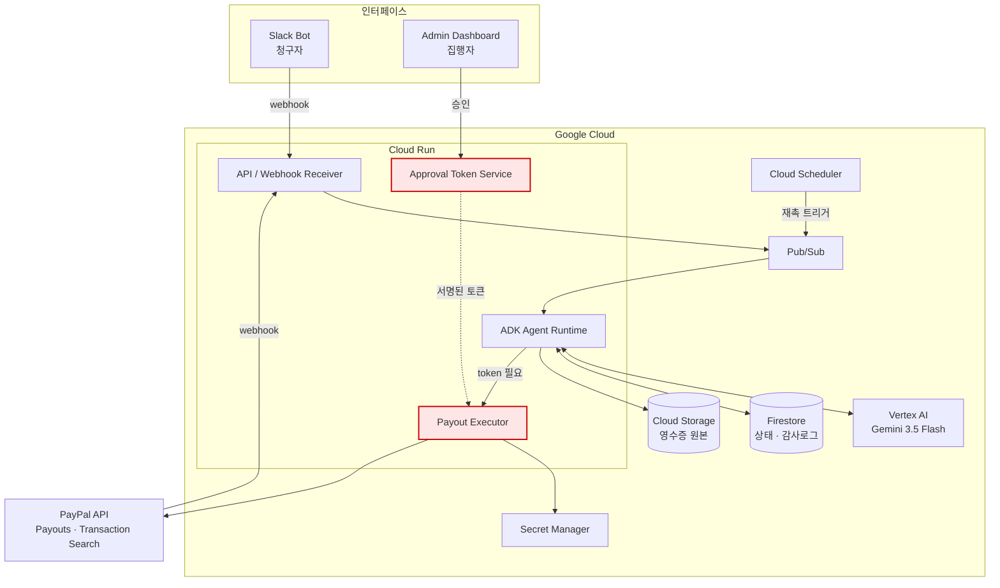
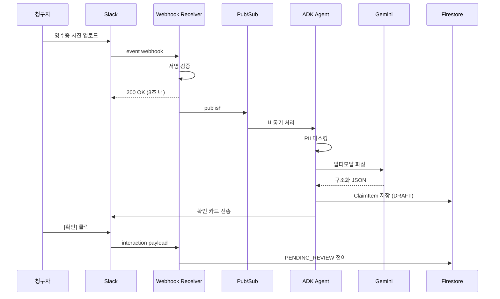
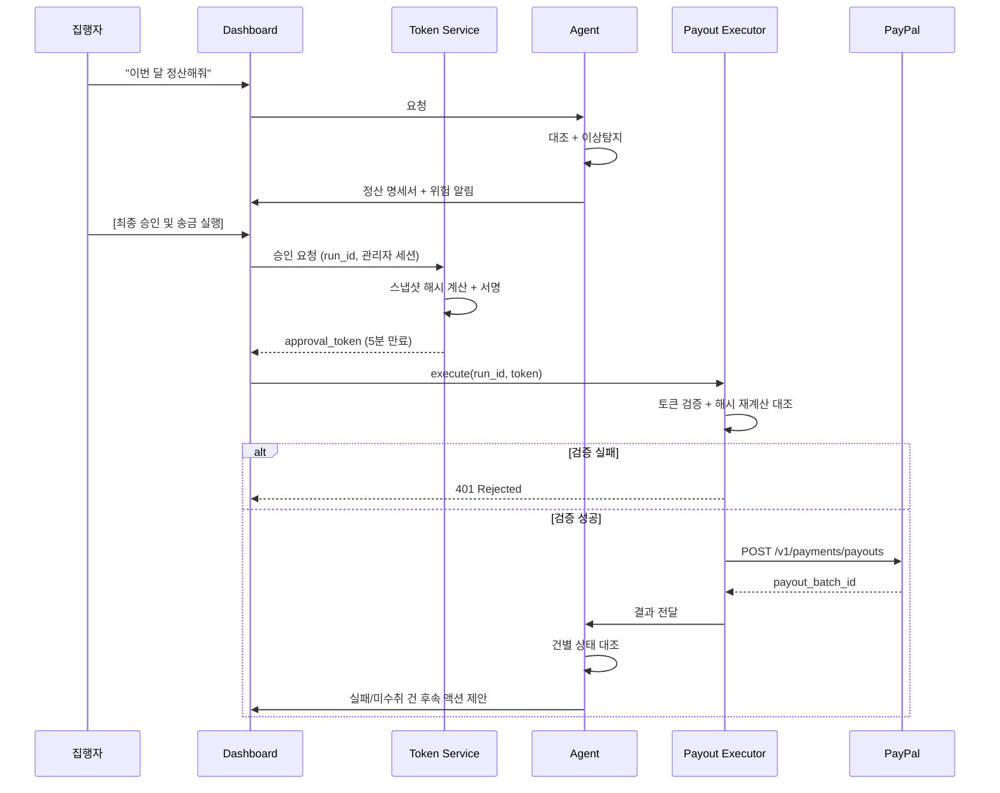

## 개발 방법 선정

### Waterfall VS Agile
- 시나리오 설계 하고 해야할까?<br>

대장님 생각 : 병렬적으로? ← 이거도 애자일 말하는 거 같음<br>
따까리 생각: 모듈별로<br>

-> 기능별로 대충 틀 잡고 애자일하게 밀어붙이기<br>


## 기능 구체화

1. (Agent) 청구 생성
2. (Agent) 지급할 목록 생성
3. (Agent) 안정성 보장
4. (FE) 집행자 Web UI
5. (BE) 집행자 Web - 메신저 Webhook - google cloud run
    1. 지급할 금액 목록을 표시?

## 프로덕트 태명 정하기

**Pay/정산 느낌**

- `PayFlow` ⭐
- `PayPilot`
- `PayMate`
- `PaySync`
- `PayLedger`
- `FlowPay`

**Agent 느낌**

- `PayAgent`
- `FinAgent`
- `LedgerAI`
- `SettleAI`
- `FinFlow`

**조금 더 스타트업스러운 이름**

- `Payout`
- `Settle`
- `Flow`
- `ClearPay`
- `Ledger`
- `Reconcile`


## 기획서 작성

<details>
<summary>기획서 1</summary>

# PayFlow (가제)

> **영수증 한 장에서 송금까지.** 흩어진 지출 증빙과 결제 원장을 스스로 대조하고, 빠진 것을 찾아 물어보고, 사람의 승인을 받아 다자간 정산을 집행하는 자율 회계 에이전트.
> 

| 항목 | 내용 |
| --- | --- |
| 대상 해커톤 | All Things Agentic Hackathon (Google / Devpost) |
| 지원 트랙 | **The Taskmaster** |
| 제출 마감 | 2026-08-31 17:00 PDT (**한국시간 2026-09-01 09:00**) |
| 팀 규모 | 3인 |
| 상태 | 기획 단계 (개발 미착수) |

---

## 목차

- 팀원
- 기획안
- 구현 명세서
- 아키텍처
- 설계 문서
- 산출물 및 실행 방법

---

## 팀원

| 이름 | GitHub | 역할 | 주요 담당 |
| --- | --- | --- | --- |
| @박수현  | @TBD |  |  |
| @송재훈  | @TBD |  |  |
| @유진 정  | @TBD |  |  |

---

## 기획안

### 1. 문제 정의

소규모 팀의 정산은 세 곳에 흩어져 있습니다.

1. **증빙**: 개인 카드로 결제한 영수증 사진이 카카오톡·슬랙·이메일에 흩어짐
2. **원장**: PayPal·카드 명세서에 결제 기록이 있지만 무엇이 업무용인지 알 수 없음
3. **지급**: 프리랜서/팀원별로 계좌를 확인해 개별 송금

지금은 재무 담당자 한 명이 이 셋을 **수작업으로 대조**합니다. 문제는 대조가 아니라 **대조의 빈칸**입니다.

- 결제는 있는데 영수증이 없다 → 아무도 청구하지 않아 개인이 손해를 본 채 잊힘
- 영수증은 있는데 지급이 안 됐다 → 청구자는 자기 10건 중 8건만 들어왔다는 걸 뒤늦게 발견
- 지난달과 똑같은 인보이스가 또 왔다 → 중복 지급
- 송금은 나갔는데 수취인이 계정을 안 만들었다 → 미수취 상태로 방치

이 빈칸들은 **누군가 먼저 물어봐야만** 메워집니다. 그리고 아무도 먼저 묻지 않습니다.

### 2. 왜 에이전트여야 하는가

이 문제는 챗봇으로 풀 수 없습니다. 사람이 “이번 달 정산해줘”라고 **말할 생각을 하기 전에** 시스템이 먼저 움직여야 하기 때문입니다.

PayFlow의 핵심은 요청 응답이 아니라 **비대칭 대조 루프**입니다.

```
결제 원장 ─┐
           ├─→ 대조 → 빈칸 발견 → 해당 사람에게 먼저 질문 → 응답 대기 → 재촉 → 확정
증빙 인입 ─┘
```

이 루프는 며칠 단위로 백그라운드에서 돌고, 사람의 응답을 기다리며 상태를 유지하고, 응답이 없으면 스스로 재촉하고, 마지막에만 사람의 승인을 요구합니다. 대화 세션 밖에서 살아 있어야 하는 워크플로이며, 이것이 Taskmaster 트랙이 요구하는 형태입니다.

### 3. 타겟 및 페르소나

**1차 타겟**: 글로벌 프리랜서/외주 인력과 협업하는 3~15인 초기 스타트업
**2차 타겟**: 공금을 관리하는 소규모 그룹 일반 (개인사업자, 대학 프로젝트팀/동아리)

> **PayPal이 정당한 이유**: 지급 대상이 여러 국가에 흩어져 있을 때, 이메일 주소만으로 96개국에 일괄 송금할 수 있는 수단은 드뭅니다. 국내 팀 내부 정산만이라면 PayPal은 과잉이지만, 원격/외주 협업 맥락에서는 대체재가 마땅치 않습니다. 타겟을 여기로 좁힌 이유입니다.
> 

| 페르소나 | 상황 | 니즈 | PayFlow가 주는 것 |
| --- | --- | --- | --- |
| **집행자** (대표/재무) | 매달 말 3시간을 대조에 씀 | 중복·오지급 방지, 시간 절약 | 검증된 정산 명세서 + 원클릭 일괄 송금 |
| **청구자** (프리랜서/팀원) | 영수증 내는 걸 자주 잊음 | 지급 누락 방지, 청구 편의 | 사진 한 장으로 청구, 누락 시 먼저 알림 |

### 4. 핵심 사용자 흐름

**(A) 청구자 — 사진 한 장**

```
슬랙에 영수증 사진 업로드
  → 에이전트가 즉시 파싱, 청구 항목 초안 생성
  → "이렇게 청구할게요: 스타벅스 강남 / ₩23,000 / 회의비" 카드 표시
  → 청구자가 확인 또는 수정
```

**(B) 청구자 — 먼저 물어보기**

```
PayPal 원장에 결제 기록 있음 + 대응하는 청구 없음
  → 에이전트가 해당 결제자에게 DM
  → "8/14 AWS Korea ₩145,000 건이 아직 청구되지 않았어요. 업무용이 맞나요?"
  → [업무용] / [개인 지출] 버튼 또는 영수증 사진 답장
  → 무응답 시 1회 재촉 → 그래도 무응답이면 '기간 경과'로 표시하고 오프라인 처리로 넘김
```

**(C) 집행자 — 승인과 집행**

```
"이번 달 외주 정산해줘"
  → 에이전트가 기간 내 청구 수집 → 원장 대조 → 이상 탐지
  → 요약 카드 렌더링 (정산 명세서 + 위험 알림 + 대조 불일치)
  → 집행자가 항목별 확인 후 [최종 승인 및 송금 실행]
  → PayPal Payouts 일괄 송금
  → 결과 대조: 실패/미수취 건 감지 → 취소 후 재발송 제안
  → 세무사 전달용 XLSX 자동 생성
```

**(D) 되돌아오는 루프 — 이게 차별점**

```
청구자가 10건 올림 → 8건만 정산 명세서에 반영됨
  → 에이전트가 "당신이 올린 10건 중 2건이 이번 정산에서 빠졌습니다" 통보
  → 이유 제시: #7은 영수증 금액과 청구 금액 불일치, #9는 OCR 실패
  → 재제출 요청 → 청구자 응답 → 재검증 → 통과 시 다음 배치 편입
```

단방향 자동화가 아니라 **양쪽 모두에게 빈칸을 되묻는** 구조입니다.

### 5. 범위

#### Must-Have (해커톤 제출 범위)

| # | 기능 | 시연 포인트 |
| --- | --- | --- |
| M1 | 슬랙 영수증 이미지 → Gemini 멀티모달 파싱 → 청구 항목 생성 | 멀티모달 |
| M2 | PayPal 결제 원장 ↔︎ 청구 항목 양방향 대조 | 자율 판단 |
| M3 | 미청구 건 감지 → DM 발송 → 응답 대기 → 1회 재촉 → 버튼 응답 처리 | 장기 실행 |
| M4 | 이상 탐지: 중복 청구 1건 + 영수증·청구 금액 불일치 1건 | 자율 판단 |
| M5 | 승인 게이트: 승인 토큰 없이는 송금 엔드포인트 호출 불가 | 아키텍처 |
| M6 | PayPal Sandbox Payouts 일괄 송금 | 실제 행동 |
| M7 | 지급 결과 대조 → 실패/UNCLAIMED 감지 → 취소 후 재발송 제안 | 실패 처리 |
| M8 | 세무사 전달용 XLSX 출력 | 산출물 |
| M9 | 감사 로그: 판단 근거 및 도구 호출 이력 저장 | 아키텍처 |

#### Won’t-Have (Phase 2 — 기획서에만 명시)

Google Drive 자동 수집 · 청구자용 별도 웹페이지 · 계약서 단가 대조 · 사업자등록번호 추출 · 부가세 매입세액 공제 판단 · 타임시트 자동 분석 · Notion 연동 · 5년 증빙 아카이빙 정책 · SaaS 구독 미사용 탐지 · 계정과목 자동 매핑 고도화

> Won’t-Have를 명시적으로 적는 이유: 심사에서 “왜 이것만 했는가”보다 “무엇을 의도적으로 잘라냈는가”가 판단력의 증거가 됩니다.
> 

### 6. 해커톤 요건 대응

#### 필수 요건 충족

| 요건 | 대응 |
| --- | --- |
| Gemini 3.5 이상 (Gemini API 또는 Vertex AI) | Vertex AI 경유 Gemini 3.5 Flash — 영수증 파싱, 대조 판단, 요약 생성 |
| Google 에이전트 프레임워크 1종 이상 | **Google ADK** — 멀티 에이전트 오케스트레이션 |
| Google Cloud 인프라 서비스 1종 이상 | **Cloud Run** (백엔드) + **Firestore** (상태/감사 로그) + **Pub/Sub** (비동기) + **Cloud Scheduler** (재촉 루프) + **Secret Manager** (자격증명) |

#### 심사 기준 대응표

| 기준 | 배점 | 우리의 답 |
| --- | --- | --- |
| **Innovation & Operational Utility** | 40% | 사람이 요청하기 전에 빈칸을 먼저 발견하고 먼저 묻는다. 단순 도구 호출이 아니라 며칠에 걸친 추적 루프. |
| **Architectural Discipline & Tech Stack** | 30% | LLM이 구조적으로 송금을 완결할 수 없는 신뢰 경계 설계. 멱등성 키, 상태 머신, 서명 검증, 실패 복구 경로. |
| **Demo & Production Readiness** | 30% | 실제 Sandbox 자금 이동 시연 + 승인 토큰 없이 호출했을 때 거부되는 장면 + Cloud Run 콘솔 노출 + 재현 가능한 README. |

#### 트랙 선택 근거

Collaborative Partner(질문하고 안내하는 에이전트)와 겹치는 부분이 있으나, PayFlow의 최종 산출물은 **실제로 집행된 송금**입니다. Taskmaster의 “텍스트를 쓰는 게 아니라 행동하는 에이전트, 지저분한 다단계 잡무” 정의에 더 정확히 맞습니다.

### 7. 성공 기준

**데모 성립 조건 (이게 안 되면 제출 의미 없음)**

- [ ]  Sandbox에서 실제로 잔액이 이동하는 장면이 영상에 담긴다
- [ ]  승인 토큰 없이 송금 엔드포인트를 호출했을 때 **거부되는 장면 5초 확보**
- [ ]  며칠간의 대기가 40초로 압축 재생되되, **동일 코드가 실제 시계로 GCP에서 실행된 로그를 병행 제시**
- [ ]  Cloud Run / Vertex AI 로그가 화면에 노출된다
- [ ]  4분 이내

---

## 구현 명세서

### 1. 기능 명세

| ID | 기능 | 입력 | 출력 | 담당 |
| --- | --- | --- | --- | --- |
| F-01 | 영수증 인입 | Slack 이미지/PDF | `ClaimItem` (DRAFT) | Agent |
| F-02 | 멀티모달 파싱 | 이미지 바이트 | 공급자·일시·금액·통화·품목 JSON | Agent |
| F-03 | PayPal 원장 수집 | 기간 | `LedgerEntry[]` | Backend |
| F-04 | 양방향 대조 | 청구 목록 + 원장 | 매칭 / 미청구 / 미지급 3분류 | Agent |
| F-05 | 이상 탐지 | 매칭 결과 | `RiskFlag[]` | Agent |
| F-06 | 추적 루프 | 미청구 건 | Slack DM + 응답 상태 | Backend + Agent |
| F-07 | 정산 배치 생성 | 확정 청구 목록 | `SettlementRun` (스냅샷 고정) | Backend |
| F-08 | 승인 토큰 발급 | 관리자 승인 | 서명된 토큰 | **Backend 전용** |
| F-09 | 송금 실행 | 배치 + 토큰 | `payout_batch_id` | Backend |
| F-10 | 결과 대조 | 배치 ID | 건별 상태 + 후속 액션 제안 | Agent |
| F-11 | 미수취 취소·재발송 | payout item ID | 취소 결과 + 신규 배치 | Backend |
| F-12 | XLSX 리포트 | 배치 ID | 세무사용 스프레드시트 | Backend |
| F-13 | 감사 로그 | 모든 판단·도구 호출 | append-only 레코드 | Backend |

### 2. 청구 항목 상태 머신

```
DRAFT
  ├─(파싱 성공)→ PENDING_REVIEW
  └─(파싱 실패)→ NEEDS_INFO ──(재제출)──┐
                    ↑                    │
PENDING_REVIEW ──(불일치/의심)───────────┘
  │
  └─(검증 통과)→ APPROVED_FOR_RUN
                    │
                    └─(배치 편입)→ QUEUED
                                     │
                    ┌────────────────┼────────────────┐
                    ↓                ↓                ↓
                  PAID           UNCLAIMED         FAILED
                                     │                │
                                (취소)│         (주소 수정)│
                                     ↓                ↓
                                 CANCELLED ──→ REQUEUED
```

**전이 규칙은 백엔드가 소유합니다.** LLM은 전이를 *제안*할 수 있을 뿐, 상태를 직접 쓰지 못합니다. 모든 전이는 화이트리스트 검증을 통과해야 하며 감사 로그에 기록됩니다.

### 3. 백엔드가 반드시 담당해야 하는 것 (DB 외)

> 기획 단계에서 나온 질문 — “DB 말고 백엔드가 필요한가?” 에 대한 답입니다. **필요합니다.** 다음은 전부 에이전트 밖에 있어야 하는 책임들입니다.
> 

| # | 책임 | 왜 에이전트가 하면 안 되는가 |
| --- | --- | --- |
| B-1 | **승인 토큰 발급·검증** | LLM이 발급할 수 있으면 승인 게이트가 무의미해짐. 신뢰 경계의 핵심. |
| B-2 | **PayPal OAuth 토큰 관리** | client secret이 LLM 컨텍스트에 절대 들어가면 안 됨. Secret Manager + 서버 측 캐싱. |
| B-3 | **웹훅 수신 및 서명 검증** | Slack 서명 검증, PayPal 웹훅 검증은 결정론적 암호 연산. LLM이 판단할 영역이 아님. |
| B-4 | **멱등성 및 분산 락** | 동일 배치가 두 번 승인되면 이중 송금. 재시도 시 동일 `sender_batch_id` 보장 필요. |
| B-5 | **장기 스케줄링** | 3일 뒤 재촉은 에이전트 세션이 끝난 뒤에도 살아 있어야 함. Cloud Scheduler + Pub/Sub. |
| B-6 | **상태 전이 검증** | LLM 환각으로 `NEEDS_INFO → PAID` 같은 전이가 일어나면 안 됨. |
| B-7 | **PII 마스킹 전처리** | 민감정보는 LLM에 *들어가기 전에* 제거되어야 함. 사후 필터링은 이미 늦음. |
| B-8 | **파일 저장 및 서명 URL** | 영수증 원본은 GCS에, 에이전트에는 참조만 전달. |
| B-9 | **감사 로그 append-only 기록** | 에이전트가 수정할 수 있는 로그는 감사 로그가 아님. |
| B-10 | **Slack 인터랙션 페이로드 검증** | 버튼을 누른 사람이 실제 승인 권한자인지 확인. |

정리하면, **에이전트는 판단하고 백엔드는 집행합니다.** 이 분리 자체가 심사 기준의 Architectural Discipline 항목에 대한 답변이 됩니다.

### 4. 에이전트 도구 정의

| 도구 | 시그니처 | 부작용 | 비고 |
| --- | --- | --- | --- |
| `parse_receipt` | `(gcs_uri) → ReceiptData` | 없음 | Gemini 멀티모달 |
| `list_paypal_ledger` | `(start, end) → LedgerEntry[]` | 없음 | 읽기 전용 |
| `list_claims` | `(filter) → ClaimItem[]` | 없음 | 읽기 전용 |
| `propose_transition` | `(claim_id, to_state, reason) → Result` | 상태 변경 | 백엔드 검증 통과 시에만 |
| `send_message` | `(user_id, blocks) → msg_id` | 메시지 발송 | 발송 이력 기록 |
| `create_settlement_run` | `(claim_ids) → run_id, snapshot_hash` | 배치 생성 | 송금 아님 |
| `execute_payout` | `(run_id, approval_token) → batch_id` | **자금 이동** | 토큰 없으면 401 |
| `check_payout_status` | `(batch_id) → items[]` | 없음 | 읽기 전용 |
| `cancel_unclaimed_item` | `(item_id, approval_token) → Result` | 자금 회수 | 토큰 필요 |
| `generate_report` | `(run_id) → gcs_uri` | 파일 생성 | XLSX |

> **`issue_approval_token`은 도구 목록에 존재하지 않습니다.** 관리자 대시보드의 서버 사이드 핸들러만 호출할 수 있으며, 이것이 “LLM 단독 송금 불가”의 물리적 구현입니다.
> 

### 5. 예외 및 엣지 케이스

| 케이스 | 처리 |
| --- | --- |
| OCR 실패 / 흐린 사진 | `NEEDS_INFO` → 청구자에게 재촬영 요청, 어느 필드를 못 읽었는지 명시 |
| 영수증 금액 ≠ 청구 금액 | 자동 통과 금지. 청구자에게 근거 요구 후 재검증 |
| 동일 영수증 중복 업로드 | 이미지 해시 + 공급자·금액·일시 조합으로 감지, 자동 병합 제안 |
| 미등록 이메일 수취인 | PayPal `UNCLAIMED` → 30일 뒤 자동 반환. 그 전에 취소 후 올바른 주소로 재발송 제안 |
| 이미 수취된 건의 회수 | **불가능.** `UNCLAIMED` 상태만 취소 가능하며, `SUCCESS` 건은 API로 되돌릴 수 없음 |
| 송금 중 API 타임아웃 | 동일 `sender_batch_id`로 재조회 우선. 신규 배치 생성 금지 |
| 승인 후 청구 내역 변경 시도 | 스냅샷 해시 불일치 → 토큰 무효화 → 재승인 요구 |
| 무응답으로 기간 경과 | `EXPIRED` 표시 후 오프라인 처리로 이관. 자동 지급하지 않음 |

> **“줬다 뺏기”에 대한 결론**: PayPal Payouts는 미수취(`UNCLAIMED`) 건만 `POST /v1/payments/payouts-item/{id}/cancel`로 취소할 수 있고, 미수취 건은 30일 후 자동으로 발신 계정에 반환됩니다. 이미 수취된 건은 회수 수단이 없습니다. **따라서 승인 게이트가 유일한 방어선이며, 이 사실이 설계 전체의 근거가 됩니다.**
> 

---

## 아키텍처

### 시스템 구성도



붉은 영역이 **신뢰 경계**입니다. 에이전트는 이 안으로 들어갈 수 없고, 문 앞에서 토큰을 제시해야만 합니다.

### 시퀀스 1 — 영수증 인입



### 시퀀스 2 — 승인과 송금



### 기술 스택

| 계층 | 선택 | 근거 |
| --- | --- | --- |
| LLM | Gemini 3.5 Flash (Vertex AI) | 해커톤 필수 요건, 멀티모달, 비용 |
| 에이전트 프레임워크 | Google ADK | 해커톤 필수 요건, 멀티 에이전트 구성 |
| 백엔드 | Cloud Run (컨테이너) | 해커톤 필수 요건, 스케일 투 제로로 비용 최소화 |
| 상태 저장소 | Firestore | 문서형 상태 머신, 실시간 리스너 |
| 비동기 | Pub/Sub | 웹훅 즉시 응답 후 처리 분리 |
| 스케줄 | Cloud Scheduler | 세션 밖 재촉 루프 |
| 파일 | Cloud Storage | 영수증 원본, 서명 URL |
| 자격증명 | Secret Manager | PayPal client secret 격리 |
| 결제 | PayPal Payouts API (Sandbox) | 이메일 기반 다국가 일괄 송금 |
| 프론트엔드 | TBD (React 또는 Next.js) | 개발 착수 시 확정 |
| 봇 | Slack Bolt | 인터랙티브 버튼, 파일 업로드 |

---

## 설계 문서

### 1. 승인 토큰 설계 (핵심 설계 결정)

**문제**: “LLM이 단독으로 송금하지 못하게 한다”를 프롬프트로 지시하는 것은 보장이 아닙니다.

**해법**: 구조적으로 불가능하게 만듭니다.

```
1. 에이전트가 SettlementRun 생성
   → 백엔드가 대상 청구 목록을 고정(freeze)하고 snapshot_hash 계산
     snapshot_hash = SHA256(정렬된 [claim_id, 수취인, 금액, 통화] 전체)

2. 관리자가 대시보드에서 명세서 확인 후 승인
   → Token Service가 서명 토큰 발급
     payload = { run_id, snapshot_hash, total_amount, approver_id, exp: now+5min }
     signature = HMAC(payload, Secret Manager 키)

3. Payout Executor가 실행 요청 수신
   → 서명 검증
   → snapshot_hash 재계산 후 토큰의 값과 대조
   → 만료 확인
   → 이미 사용된 토큰인지 확인 (일회용)
   → 전부 통과해야 PayPal 호출
```

**이 설계가 막는 것**

| 공격/사고 | 차단 지점 |
| --- | --- |
| 프롬프트 인젝션으로 “송금해” 유도 | 토큰이 없어 401 |
| 에이전트가 승인 후 금액을 몰래 수정 | 스냅샷 해시 불일치 |
| 토큰 재사용으로 이중 송금 | 일회용 + 멱등성 키 |
| 승인 화면을 오래 열어둔 뒤 실행 | 5분 만료 |
| 권한 없는 사람의 버튼 클릭 | Slack/세션 서명 검증 |

**데모에서 반드시 보여줄 것**: 토큰 없이 `execute_payout`을 호출하는 장면과 그것이 거부되는 로그. 5초면 충분하고, Architectural Discipline 30점에 직접 작용합니다.

### 2. 멱등성 설계

- `sender_batch_id = settlement_run_id` — PayPal이 중복 배치를 자체 거부
- 실행 요청 시 `Idempotency-Key` 헤더 필수, Firestore에 결과 캐싱
- 타임아웃 발생 시 **신규 생성 금지**, 반드시 `GET /v1/payments/payouts/{batch_id}` 재조회 우선
- 재발송은 신규 `run_id`를 발급하되, 원본 run과의 관계를 `reissued_from` 필드로 추적

### 3. 이상 탐지 규칙

| ID | 규칙 | 판정 | 조치 |
| --- | --- | --- | --- |
| R1 | 동일 공급자 + 동일 금액 + 30일 내 재청구 | 중복 의심 | 승인 보류, 관리자에게 두 건 나란히 제시 |
| R2 | 영수증 파싱 금액 ≠ 청구 금액 | 불일치 | 자동 통과 금지, 청구자에게 근거 요구 |
| R3 | 원장에 결제 있음 + 대응 청구 없음 | 미청구 | 결제자에게 DM 발송, 추적 루프 시작 |
| R4 | 청구 있음 + 지급 결과에 없음 | 지급 누락 | 청구자에게 사유 통보, 재검증 |
| R5 | `UNCLAIMED` 상태 N일 경과 | 미수취 | 취소 + 주소 확인 + 재발송 제안 |

R1과 R2는 Gemini의 판단을 쓰되, **판단 근거를 자연어로 남기도록** 강제합니다. 이 근거가 감사 로그의 핵심 자산입니다.

### 4. 보안 및 가드레일

| 항목 | 설계 |
| --- | --- |
| 자동 송금 한도 | 1회 및 월간 상한 캡. 초과 시 승인 요청 자체가 차단 |
| 자율 송금 차단 | 위 승인 토큰 구조 |
| PII 마스킹 | 주민등록번호·카드번호·CVC·여권번호를 **LLM 입력 전** 정규식 + 비전 사전 필터로 제거 |
| 자격증명 격리 | PayPal secret은 Secret Manager에만. 에이전트 컨텍스트에 절대 노출 안 됨 |
| 최소 권한 | PayPal REST 앱 스코프를 Payouts + Transaction Search로 한정 |
| 로그 마스킹 | 감사 로그에도 수취인 이메일은 부분 마스킹 저장 |

### 5. 관측성 및 감사 로그

모든 레코드는 append-only이며 다음을 포함합니다.

```json
{
  "trace_id": "...",
  "actor": "agent | human | system",
  "action": "propose_transition",
  "target": "claim_xxx",
  "reasoning": "영수증 금액 23,000원과 청구 금액 32,000원이 불일치하여 NEEDS_INFO로 제안",
  "tool_calls": [...],
  "model": "gemini-3.5-flash",
  "timestamp": "..."
}
```

`reasoning` 필드가 있어야 “왜 이 금액이 산출되었는가”에 답할 수 있습니다. 금융 도메인에서 설명 불가능한 자동화는 채택되지 않습니다.

### 6. 데모 시간 압축 설계

며칠짜리 추적 루프를 4분 영상에 담기 위한 설계입니다.

```
ClockProvider 인터페이스로 시간 소스를 추상화
  ├─ RealClock       : 프로덕션 (Cloud Scheduler 실제 주기)
  └─ VirtualClock    : DEMO_MODE=true 일 때 가속 재생
```

**정직성 확보**: 압축 재생 장면 옆에 **동일 코드가 실제 시계로 GCP에서 돌아간 Cloud Logging 스크린샷**을 병행 제시합니다. 시연을 위해 로직을 바꾼 것이 아니라 시계만 주입했다는 사실이 드러나야 합니다.

### 7. 데모 데이터셋

| # | 데이터 | 시연 목적 |
| --- | --- | --- |
| 1 | 정상 프리랜서 인보이스 2건 | 기본 플로우 |
| 2 | 고의 중복 인보이스 1건 | R1 이상 탐지 |
| 3 | 영수증 이미지와 청구 금액 불일치 1건 | R2 판단 + 재요청 루프 |
| 4 | PayPal 결제 있으나 영수증 미제출 1건 | R3 추적 루프 |
| 5 | 미등록 이메일 수취인 1명 | UNCLAIMED → 취소 → 재발송 |

계정: PayPal Sandbox 비즈니스 발신 1개 + 수신 가상 계정 3개

---

## 산출물 및 실행 방법

### 제출물 체크리스트

- [ ]  카테고리 선택 (The Taskmaster)
- [ ]  호스팅된 프로젝트 URL (선택이지만 권장)
- [ ]  텍스트 설명 — 기능, 사용 기술, 데이터 소스, 배운 점
- [ ]  공개 코드 저장소 (비공개 시 `testing@devpost.com`, `cloudhackathons@google.com` 초대)
- [ ]  README 내 Spin-up Instructions (재현 가능성 증명)
- [ ]  아키텍처 다이어그램
- [ ]  4분 데모 영상 (Google Cloud 백엔드 실행 증거 포함)
- [ ]  (보너스) 빌드 과정 블로그/영상 공개 게시
- [ ]  (보너스) SNS 게시 — `#AllThingsAgenticHackathon`

### 저장소 구조 (예정)

```
payflow/
├── agent/            # ADK 에이전트 정의, 도구, 프롬프트
├── backend/          # Cloud Run API, 토큰 서비스, PayPal 연동
├── web/              # 관리자 대시보드
├── bot/              # Slack Bolt 봇
├── infra/            # Terraform 또는 gcloud 스크립트
├── demo/             # 시드 데이터, 데모 시나리오 스크립트
├── docs/             # 아키텍처 다이어그램, 설계 문서
└── README.md
```

### 환경 변수

| 변수 | 설명 | 비고 |
| --- | --- | --- |
| `GOOGLE_CLOUD_PROJECT` | GCP 프로젝트 ID |  |
| `VERTEX_LOCATION` | Vertex AI 리전 |  |
| `PAYPAL_CLIENT_ID` | PayPal 앱 클라이언트 ID | Secret Manager |
| `PAYPAL_CLIENT_SECRET` | PayPal 앱 시크릿 | Secret Manager |
| `PAYPAL_ENV` | `sandbox` / `live` | 기본 `sandbox` |
| `SLACK_BOT_TOKEN` | Slack 봇 토큰 | Secret Manager |
| `SLACK_SIGNING_SECRET` | Slack 서명 검증 키 | Secret Manager |
| `APPROVAL_SIGNING_KEY` | 승인 토큰 서명 키 | Secret Manager |
| `DEMO_MODE` | 가상 시계 활성화 | 기본 `false` |

### 로컬 실행

```bash
#TBD — 개발 착수 후 작성
```

### 배포

```bash
#TBD — 개발 착수 후 작성
```

### 개발 일정 (D-15)

| 기간 | 목표 | 산출물 |
| --- | --- | --- |
| 8/16~8/17 | 환경 셋업 | GCP 프로젝트, PayPal Sandbox 계정, 레포 스켈레톤, ADK Hello World |
| 8/18~8/20 | 인입 파이프라인 | Slack 봇, 영수증 파싱, Firestore 스키마, ClaimItem 생성 |
| 8/21~8/23 | 대조 엔진 | PayPal 원장 조회, 양방향 대조, 이상 탐지, 관리자 대시보드 초안 |
| 8/24~8/26 | 실행 계층 | 승인 토큰 서비스, Payouts 송금, 결과 대조, 취소·재발송 |
| 8/27~8/28 | 추적 루프 + 산출물 | Cloud Scheduler 재촉, XLSX, 감사 로그, 가상 시계 |
| 8/29 | 데모 준비 | 시드 데이터 투입, 리허설, 아키텍처 다이어그램 |
| 8/30 | 촬영 및 문서 | 4분 영상, README, 제출 텍스트 |
| 8/31 | 버퍼 및 제출 | 마감 한국시간 9/1 09:00 |

> **8/24까지 M6(Sandbox 송금)이 동작하지 않으면 M3(추적 루프)를 축소하고 실행 계층에 집중합니다.** 심사 기준상 “실제로 돈이 움직이는 장면”이 가장 큰 가중치를 갖습니다.
> 

---

## 리스크 및 대응

| 리스크 | 영향 | 대응 |
| --- | --- | --- |
| PayPal Sandbox Payouts 권한 활성화 지연 | 치명적 | **D-1(8/16)에 최우선으로 확인.** 막히면 Invoicing API로 대체 시연 후 Payouts는 코드로 제시 |
| 한국 계정의 Payouts 프로덕션 제약 | 낮음 | 해커톤은 Sandbox만 사용. 기획서에 명시적으로 언급하여 신뢰 확보 |
| 3인 15일 일정 초과 | 높음 | Won’t-Have 목록을 방어선으로 사용. M1~M9 외 기능 추가 금지 |
| Gemini 영수증 파싱 정확도 | 중간 | 파싱 실패를 버그가 아닌 **기능(NEEDS_INFO 루프)으로 설계**했으므로 실패도 시연 소재 |
| 데모 영상 4분 초과 | 중간 | 8/29 리허설에서 초 단위 타임라인 확정 |
| GCP 비용 | 낮음 | Cloud Run 스케일 투 제로, Gemini Flash, $150 크레딧 |

</details>
[기획서2](https://github.com/park-song-jungyujin/payflow-docs/blob/main/README.md)
